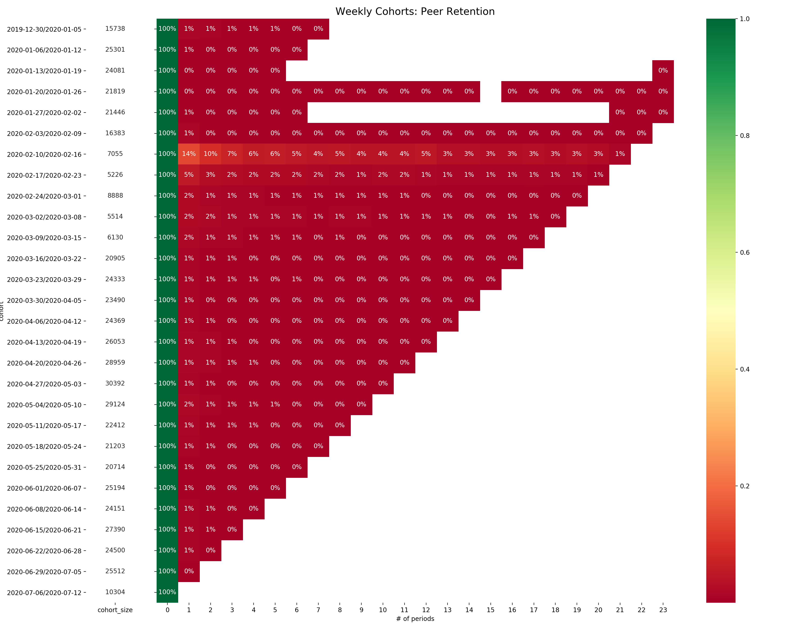

# Description

This Python script generates graphs visualizing peer retention in Status app.

# Details

The script queries an ElasticSearch endpoint for `logstash-*` indices and aggregates counts of instances of log messages with set `peer_id` field.

This data is then analyzed using [Pandas](https://pandas.pydata.org/) and graphed using [Seaborn](https://seaborn.pydata.org/) in the form of 

This was built from a combination of a [CSV generating script](https://github.com/status-im/infra-utils/blob/d1e0426cc28a1b20a182f341c55c4e295912fe35/elasticsearch/unique_count.py) and a [cohort analysis](https://colab.research.google.com/drive/1Osl3EXbKR2_iwAhOHmAiCum9F6IquRX2) done by [@jakubgs](https://github.com/jakubgs) and [@bgits](https://github.com/bgits).

# Usage

The script provides a number of options:
```
Usage: main.py [options]

This generates a CSV with buckets of peer_ids for every day.

Options:
  -h, --help            show this help message and exit
  -H ES_HOST, --host=ES_HOST
                        ElasticSearch host.
  -P ES_PORT, --port=ES_PORT
                        ElasticSearch port.
  -i INDEX_PATTERN, --index-pattern=INDEX_PATTERN
                        Patter for matching indices.
  -f FIELD, --field=FIELD
                        Name of the field to count.
  -F FLEET, --fleet=FLEET
                        Name of the fleet to query.
  -m MAX_SIZE, --max-size=MAX_SIZE
                        Max number of counts to find.
  -d IMAGE_DPI, --image-dpi=IMAGE_DPI
                        DPI of generated PNG images.
  -o OUTPUT_DIR, --output-dir=OUTPUT_DIR
                        Dir into which images are generated.

Example: ./unique_count.py -i "logstash-2019.11.*" -f "peer_id"
```

# Example


